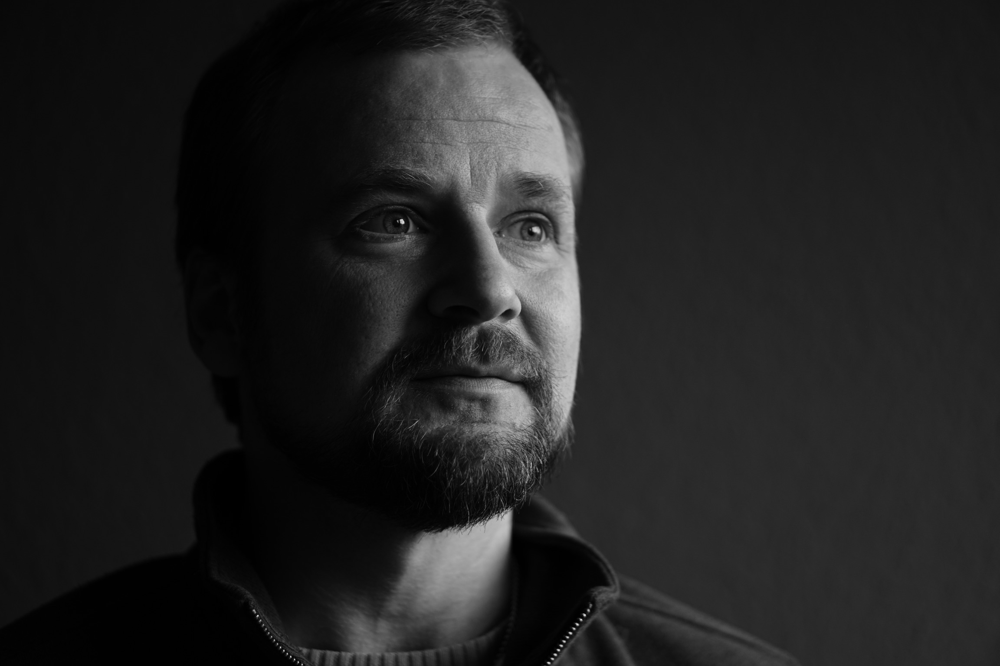

## MATTHIAS BAUMANN, SKANDINAVIENALLEE 2, 25479 ELLERAU

# LEBENSLAUF

### PERSÖHNLICHE DATEN
Geburtsdatum | Geburtsort | Familienstand
-------------|------------|--------------
18.4.1984 | Hamburg | 2 Kinder (9 und 12)

### BERUFLICHE ERFAHRUNGEN
Seit 07.2021    
* Weiterbildung zum **Web- und Appentwickler** bei DCI (remote)
.

08.2020-07.2021
* Generalisierhe **Erzieherausbildung** im SOS-Kinderdorf Harksheide
    * Schulische Erzieherausbildung FSP2 Altona
    * Arbeit in familienähnlicher Wohngruppe für Kinder, die nicht mehr bei ihren leiblichen Eltern leben können

04.2020-07.2020
* **Kundenberater** bei Audibene Hörgeräte
    * Verkauf von Hörgeräten in Zusammenarbeit mit Akusiterkn vor Ort
    * Arbeit per Computer/Telefon aus dem Homeoffice

02.2017-03.2020
* **Filialleiter** Vodafone-Shop Bad Bramstedt
    * Batunrg und Verkauf von Mobilfunk-, Festnetz- und TV-Verträgen
    * Ausbildung von Azubis zum Einzelhandelskaufmann
    * Fuhrung und Coaching von Mitarbeitern

07.2016-01.2017
* **Verkaufsberater** Vodafone Business-Premium-Store Itzehoe
    * Verkauf von Mobilfunk-, Festnetz- und TV-Verträgen

11.2015-06.2016
* Fachberater neue Medien MediaMarkt Hamburg Altona

03.2014-03.2015
* Abschlussarbeiten der **Selbstständigkeit**, Mitarbeit an **Unternehmensgründung** Manufaktur Lüders

03.2014-03.2015
* Selbstständiger **Baufinanzierungsberater**/LBS-Pinneberg

10.2010-02.2014
* **LBS-Sparkassenbezirksleiter** Sparkasse Elmshorn
    * Kundenberatung bezüglich Buasparen
    * Kundenberatung und Coaching bezüglich zur Einbindung von Bausparverträgen in Finanzierungen
    * Schulung und Coaching von Mitarbeitern und Azubis
    * Produkteinführung Wohnriester
    * Verantwortung für den Bausparumsatz der Sparkasse (vervierfacht)
    
07.2008-03.2010
* Studentische Aushilfe, Vodafone Firmenkundenvertrieb
    * Entwicklungs und Einfühurung eines Excell-Tarifoptimierung

06.2006-09.2007
* Angestellt als **Jugend- und Privatkundenberater**, Haspa in Bergstedt

### AUSBILDUNG UND STUDIUM.
09.2007-09.2010
* 5 Semester **Betriebswirtschaftslehre,** Universität Hamburg (Vollzeitstudium)

08.2004-06.2006
* Ausbildung zum **Bankkaufmann** bei der Haspa

07.1991-06.2004
* **Abitur** an der Rudolf-Steiner-Schule Hamburg-Wandsbek
### LINKS UND PROJEKTE
* Website under construction:
[Fahrradfreunde](https://mcbauman.github.io/fahrradfreunde/)  
* a little game using js:
[Kniffel](https://mcbauman.github.io/kniffel/)

 
 

Ellerau 22.07.2021

## TEL: +49173 20 30 404, EMAIL: M.C.BAUMANN@ICLOUD.COM